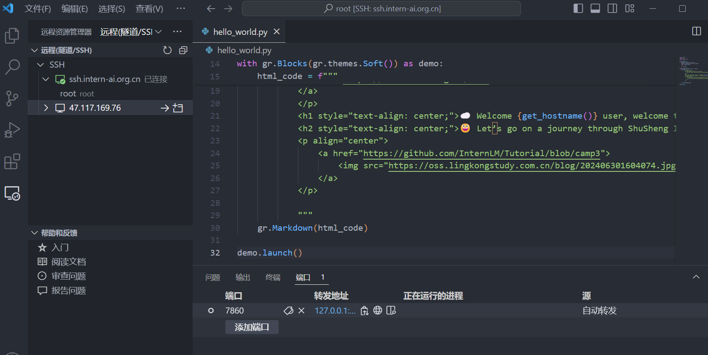
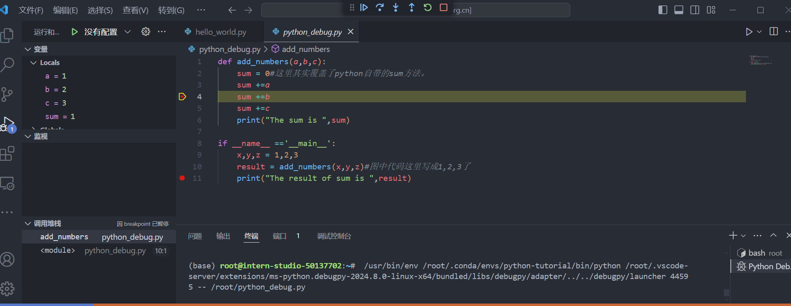
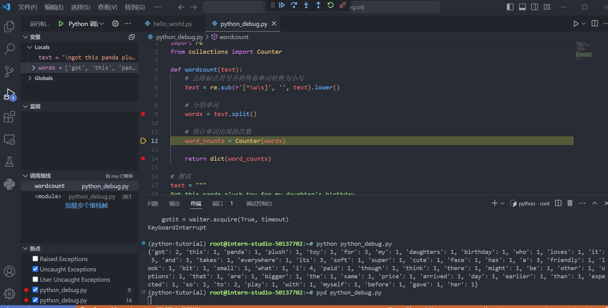

## Linux基础任务  

### InternStudio开发机配置  
创建开发机，选择对应的配置即可。可以可视化查看开发机中的文件及文件夹，而且如果创建了两个开发机，那么他们使用的云盘是一个。因为每一个开发机都是一个Docker 容器，存储云盘挂载的都是一个，可以上传文件或者文件夹，以及创建文件，查看隐藏文件。  
这里测试连接，那么选择cuda版本为12.2，资源配置为10%，然后选择进入开发机，可以有三种形式开发-jupyterlab，terminal，vscode  

### SSH连接及端口映射  
- SSH连接  

SSH是一种网络安全协议，通过加密和认证机制实现安全的访问和文件传输等业务。SSH 协议通过对网络数据进行加密和验证，在不安全的网络环境中提供了安全的网络服务。SSH 是（C/S架构）由服务器和客户端组成，为建立安全的 SSH 通道，双方需要先建立 TCP 连接，然后协商使用的版本号和各类算法，并生成相同的会话密钥用于后续的对称加密。在完成用户认证后，双方即可建立会话进行数据交互。  
连接方式：在开发机界面选择ssh连接后，打开本地电脑上的powershell，将前面对应的ssh与密码复制进去即可。  

**在Vscode中配置SSH连接**：安装remote ssh插件，点击增加ssh连接，然后将前面的登录命令与密码复制进去。  

- 端口映射  

端口映射是一种网络技术，它可以将外网中的任意端口映射到内网中的相应端口，实现内网与外网之间的通信。通过端口映射，可以在外网访问内网中的服务或应用，实现跨越网络的便捷通信。  
> 个人PC会远程连接到开发机唯一暴露在外的37367端口，（这个在SSH的时候提到过每个人的开发机暴露的端口都不一样），并设置隧道选项。暴露端口是作为中转站进行流量的转发。 
> 当在个人PC上执行这个SSH命令后，SSH客户端会在本地机器的7860端口上监听。 
> 任何发送到本地7860端口的流量，都会被SSH隧道转发到远程服务器的127.0.0.1地址上的7860端口。 
> 这意味着，即使开发机的这个端口没有直接暴露给外部网络，我们也可以通过这个隧道安全地访问远程服务器上的服务  

映射方法：开发机页面进入自定义服务，复制第一条终端命令到远程连接上ssh的vscode命令行即可。  

  


### linux命令  

创建文件：touch  
创建目录：mkdir  
目录切换：cd  
显示当前目录：pwd  
查看文件内容：cat，more和less可以分页  
编辑文件：vi或vim，命令模式按i or a or o进入编辑，按：进入末行模式，esc退回命令    
复制文件：cp  
创建文件链接：用ln  
移动文件：mv  
删除文件：rm  
删除目录：rmdir(只能删空)或rm -r(可删非空)  
查找文件： find  
查看文件或目录的详细信息：ls ，ls -l查看详细信息  
处理文件：sed  

## python基础任务  

### conda的安装  

Conda是一个开源的软件包管理系统和环境管理系统，它主要用于安装多个版本的软件包及其依赖关系，并能轻松地在它们之间切换。  
略  
常用命令：conda list、conda create、conda activate、conda deactivate、conda install、conda update、conda remove、conda env list  

### 单词计数与debug设置  



单词计数：  
```python  
import re
from collections import Counter

def wordcount(text):
    # 去除标点符号并将所有单词转换为小写
    text = re.sub(r'[^\w\s]', '', text).lower()
    
    # 分割单词
    words = text.split()
    
    # 统计单词出现的次数
    word_counts = Counter(words)
    
    return dict(word_counts)

# 测试
text = """
Got this panda plush toy for my daughter's birthday,
who loves it and takes it everywhere. It's soft and
super cute, and its face has a friendly look. It's
a bit small for what I paid though. I think there
might be other options that are bigger for the
same price. It arrived a day earlier than expected,
so I got to play with it myself before I gave it
to her.
"""

print(wordcount(text))
```  



## git操作  

Git 是一种开源的分布式版本控制系统，广泛应用于软件开发领域，尤其是在协同工作环境中。它为程序员提供了一套必备的工具，使得团队成员能够有效地管理和跟踪代码的历史变更。  
官网：[https://git-scm.com/](https://git-scm.com/)  

### 破冰与个人项目  

开发一般流程：  
```python  
git clone https://github.com/MrCatAI/Tutorial.git # 修改为自己frok的仓库
cd Tutorial/
git branch -a
git checkout -b camp3 origin/camp3  
```  

上传：  
```python  
git add .  
git commit -m "comments"  
git push  
```  


