## 书生demo  
在开发机内部署InternLM2-chat-1.8b模型demo，8G显存玩转书生大模型demo任务    

### cli demo部署  

开发机内已经配置好了预置的环境icamp3_demo，这里使用该环境。  

激活一下：  

```bash  
conda activate /root/share/pre_envs/icamp3_demo  

```  

创建对应的文件，然后写下述demo.py文件：  

```python  
import torch
from transformers import AutoTokenizer, AutoModelForCausalLM


model_name_or_path = "/root/share/new_models/Shanghai_AI_Laboratory/internlm2-chat-1_8b"

tokenizer = AutoTokenizer.from_pretrained(model_name_or_path, trust_remote_code=True, device_map='cuda:0')
model = AutoModelForCausalLM.from_pretrained(model_name_or_path, trust_remote_code=True, torch_dtype=torch.bfloat16, device_map='cuda:0')
model = model.eval()

system_prompt = """You are an AI assistant whose name is InternLM (书生·浦语).
- InternLM (书生·浦语) is a conversational language model that is developed by Shanghai AI Laboratory (上海人工智能实验室). It is designed to be helpful, honest, and harmless.
- InternLM (书生·浦语) can understand and communicate fluently in the language chosen by the user such as English and 中文.
"""

messages = [(system_prompt, '')]

print("=============Welcome to InternLM chatbot, type 'exit' to exit.=============")

while True:
    input_text = input("\nUser  >>> ")
    input_text = input_text.replace(' ', '')
    if input_text == "exit":
        break

    length = 0
    for response, _ in model.stream_chat(tokenizer, input_text, messages):
        if response is not None:
            print(response[length:], flush=True, end="")
            length = len(response)

```  

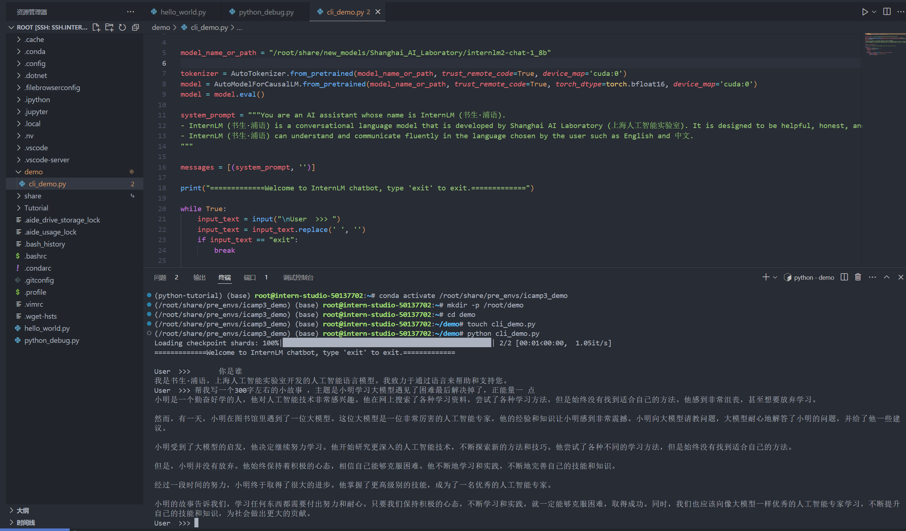

### streamlit web demo 部署  

该部分学习使用streamlit部署InternLM2-chat-1.8b模型。  

首先将仓库拉到root目录下，然后然后启动对应的py文件：  
```bash  
cd /root/Tutorial
streamlit run /root/Tutorial/tools/streamlit_demo.py --server.address 127.0.0.1 --server.port 6006  

```  

vscode会自动映射端口，所以可以在浏览器上访问本地6006端口启动demo。  

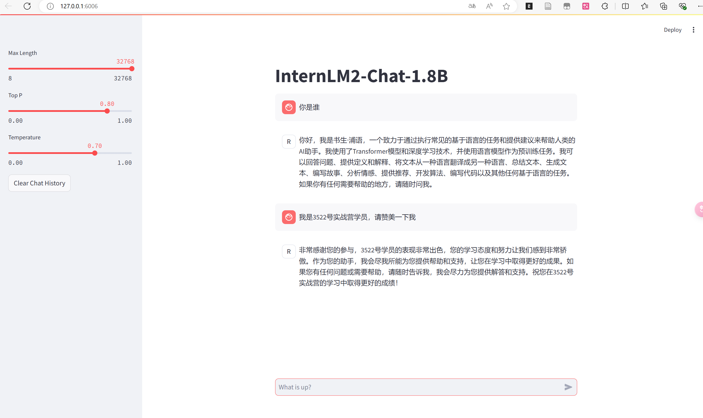  


### LMDeploy 部署 InternLM-XComposer2-VL-1.8B模型  

InternLM-XComposer2 是一款基于 InternLM2 的视觉语言大模型，其擅长自由形式的文本图像合成和理解。其主要特点包括：  
- 自由形式的交错文本图像合成：InternLM-XComposer2 可以根据大纲、详细文本要求和参考图像等不同输入，生成连贯且上下文相关，具有交错图像和文本的文章，从而实现高度可定制的内容创建。  
- 准确的视觉语言问题解决：InternLM-XComposer2 基于自由形式的指令准确地处理多样化和具有挑战性的视觉语言问答任务，在识别，感知，详细标签，视觉推理等方面表现出色。  
- 令人惊叹的性能：基于 InternLM2-7B 的InternLM-XComposer2 在多个基准测试中位于开源多模态模型第一梯队，而且在部分基准测试中与 GPT-4V 和 Gemini Pro 相当甚至超过它们。  

LMDeploy 是一个用于压缩、部署和服务 LLM 的工具包，由 MMRazor 和 MMDeploy 团队开发。它具有以下核心功能：

- 高效的推理：LMDeploy 通过引入持久化批处理、块 KV 缓存、动态分割与融合、张量并行、高性能 CUDA 内核等关键技术，提供了比 vLLM 高 1.8 倍的推理性能。  
- 有效的量化：LMDeploy 支持仅权重量化和 k/v 量化，4bit 推理性能是 FP16 的 2.4 倍。量化后模型质量已通过 OpenCompass 评估确认。  
- 轻松的分发：利用请求分发服务，LMDeploy 可以在多台机器和设备上轻松高效地部署多模型服务。  
- 交互式推理模式：通过缓存多轮对话过程中注意力的 k/v，推理引擎记住对话历史，从而避免重复处理历史会话。  
- 优秀的兼容性：LMDeploy支持 KV Cache Quant，AWQ 和自动前缀缓存同时使用  

接下来，演示使用LMDeploy部署InternLM-XComposer2-VL-1.8B模型。  

```bash  
conda activate /root/share/pre_envs/icamp3_demo  
lmdeploy serve gradio /share/new_models/Shanghai_AI_Laboratory/internlm-xcomposer2-vl-1_8b --cache-max-entry-count 0.1  

```  

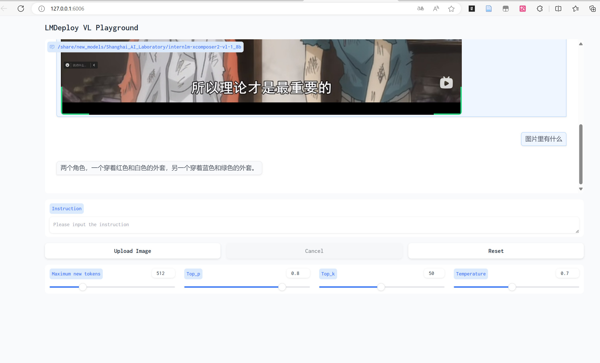

### LMDeploy 部署 InternVL2-2B 模型  

InternVL2 是上海人工智能实验室推出的新一代视觉-语言多模态大模型，是首个综合性能媲美国际闭源商业模型的开源多模态大模型。InternVL2 系列从千亿大模型到端侧小模型全覆盖，通专融合，支持多种模态。

LMDeploy 也已经支持了 InternVL2 系列模型的部署，让我们一起来使用 LMDeploy 部署 InternVL2-2B 模型。

我们可以通过下面的命令来启动 InternVL2-2B 模型的 Gradio 服务。  

```bash  
conda activate /root/share/pre_envs/icamp3_demo  
lmdeploy serve gradio /share/new_models/OpenGVLab/InternVL2-2B --cache-max-entry-count 0.1  
```  

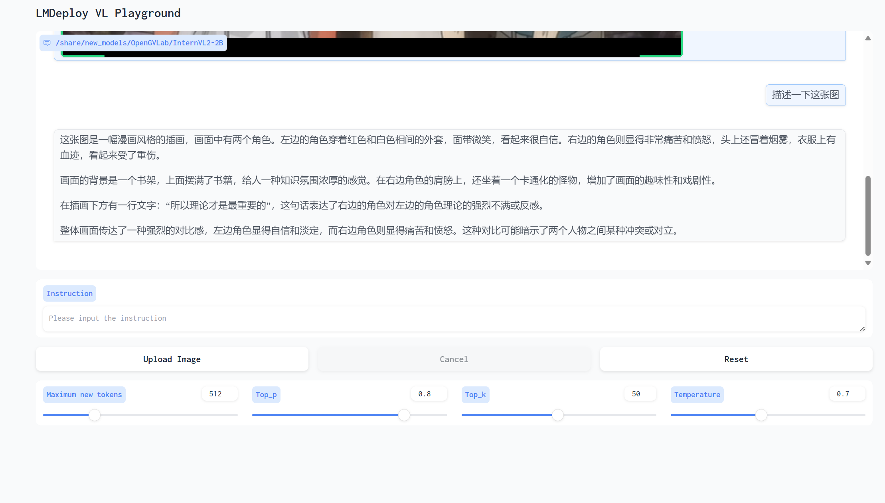  


## 浦语提示词工程  

### 环境与模型api部署  

先创建一个langgpt虚拟环境  
```bash  
# 创建虚拟环境
conda create -n langgpt python=3.10 -y
```  

在虚拟环境中安装对应的依赖，构造需求文件如下：  

```txt  
transformers==4.43.3
streamlit==1.37.0
huggingface_hub==0.24.3
openai==1.37.1
lmdeploy==0.5.2

```  

安装运行：`pip install -r requirements.txt`  

后面将部署的模型整理成后台模式，可以使用工具tmux来实现。  
```  
apt-get install tmux  
```  
如果使用intern-studio开发机，可以直接在路径`/share/new_models/Shanghai_AI_Laboratory/internlm2-chat-1_8b`下找到模型  

部署为api的方式，用tmux建立新窗口  

```bash   
tumx new -t langgpt  
tmux a -t langgpt  
CUDA_VISIBLE_DEVICES=0 lmdeploy serve api_server /share/new_models/Shanghai_AI_Laboratory/internlm2-chat-1_8b --server-port 23333 --api-keys internlm2  
#进入项目路径运行对应的图形界面  
python -m streamlit run chat_ui.py  
```  

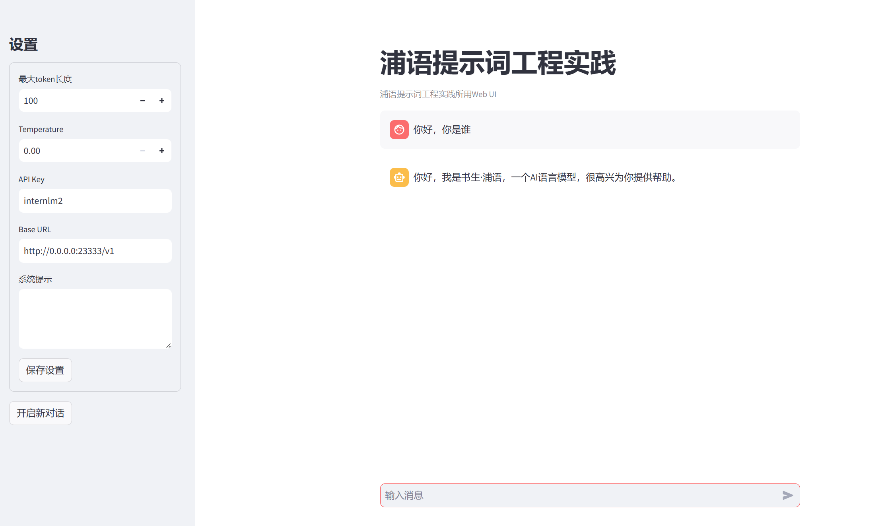


### prompt工程  

Prompt是一种用于指导以大语言模型为代表的生成式人工智能生成内容(文本、图像、视频等)的输入方式。它通常是一个简短的文本或问题，用于描述任务和要求。

Prompt可以包含一些特定的关键词或短语，用于引导模型生成符合特定主题或风格的内容。例如，如果我们要生成一篇关于“人工智能”的文章，我们可以使用“人工智能”作为Prompt，让模型生成一篇关于人工智能的介绍、应用、发展等方面的文章。

Prompt还可以包含一些特定的指令或要求，用于控制生成文本的语气、风格、长度等方面。例如，我们可以使用“请用幽默的语气描述人工智能的发展历程”作为Prompt，让模型生成一篇幽默风趣的文章。

总之，Prompt是一种灵活、多样化的输入方式，可以用于指导大语言模型生成各种类型的内容。  
提示工程是一种通过设计和调整输入(Prompts)来改善模型性能或控制其输出结果的技术。

在模型回复的过程中，首先获取用户输入的文本，然后处理文本特征并根据输入文本特征预测之后的文本，原理为next token prediction。

提示工程是模型性能优化的基石。  

近期相关研究发现，LLM在对比浮点数字时表现不佳，经验证，internlm2-chat-1.8b (internlm2-chat-7b)也存在这一问题，例如认为13.8<13.11。   

在系统提示部分添加如下提示词可解决该问题：  

`prompt: 你是一个优秀的数学家，当你在比较浮点数数据的时候。你明白，小数点后的数据在进行按位比较时，越靠近小数点的值越大，那么代表小数部分越大。`   

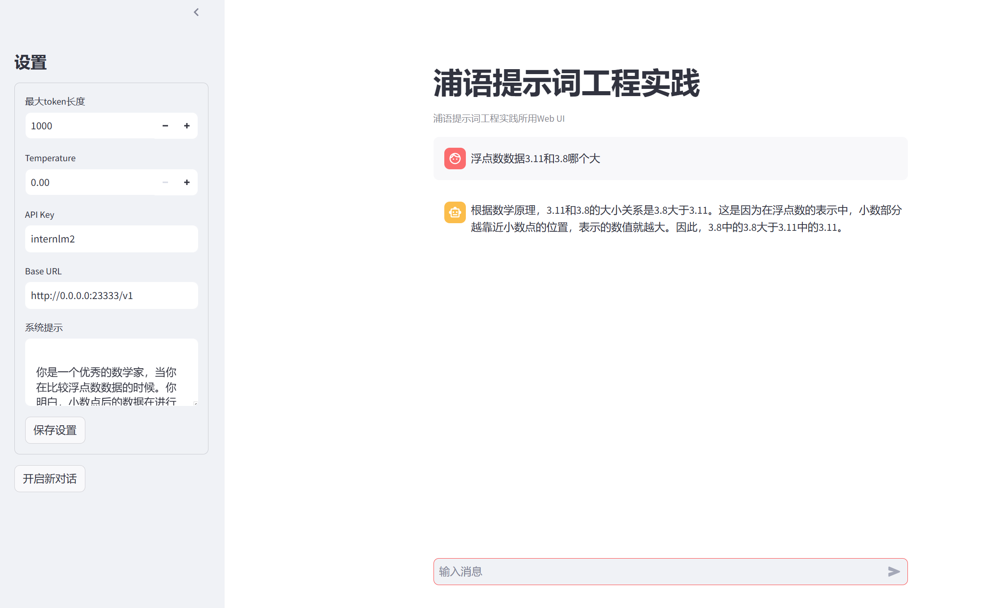  


## llamaindex+Internlm2 RAG实践  

 给模型注入新知识的方式，可以简单分为两种方式，一种是内部的，即更新模型的权重，另一个就是外部的方式，给模型注入格外的上下文或者说外部信息，不改变它的的权重。 第一种方式，改变了模型的权重即进行模型训练，这是一件代价比较大的事情，大语言模型具体的训练过程，可以参考InternLM2技术报告。第二种方式，并不改变模型的权重，只是给模型引入格外的信息。类比人类编程的过程，第一种方式相当于你记住了某个函数的用法，第二种方式相当于你阅读函数文档然后短暂的记住了某个函数的用法。  

### 环境模型准备  

 安装虚拟环境，对应的依赖，以及llamaindex  

 ```bash  
conda activate llamaindex
conda install pytorch==2.0.1 torchvision==0.15.2 torchaudio==2.0.2 pytorch-cuda=11.7 -c pytorch -c nvidia  
pip install einops
pip install  protobuf  
conda activate llamaindex
pip install llama-index==0.10.38 llama-index-llms-huggingface==0.2.0 "transformers[torch]==4.41.1" "huggingface_hub[inference]==0.23.1" huggingface_hub==0.23.1 sentence-transformers==2.7.0 sentencepiece==0.2.0  

 ```  

 **下载词向量模型**  
 打开一个py文件，写入下面内容运行  

```python  
import os

# 设置环境变量
os.environ['HF_ENDPOINT'] = 'https://hf-mirror.com'

# 下载模型
os.system('huggingface-cli download --resume-download sentence-transformers/paraphrase-multilingual-MiniLM-L12-v2 --local-dir /root/model/sentence-transformer')  

```  

同理下载NLTK相关资源  

```bash  
cd /root
git clone https://gitee.com/yzy0612/nltk_data.git  --branch gh-pages
cd nltk_data
mv packages/*  ./
cd tokenizers
unzip punkt.zip
cd ../taggers
unzip averaged_perceptron_tagger.zip  

```  

将预下载的InternLm2 1.8b软链出来，运行下文件  

```python  
from llama_index.llms.huggingface import HuggingFaceLLM
from llama_index.core.llms import ChatMessage
llm = HuggingFaceLLM(
    model_name="/root/model/internlm2-chat-1_8b",
    tokenizer_name="/root/model/internlm2-chat-1_8b",
    model_kwargs={"trust_remote_code":True},
    tokenizer_kwargs={"trust_remote_code":True}
)

rsp = llm.chat(messages=[ChatMessage(content="xtuner是什么？")])
print(rsp)  

```  
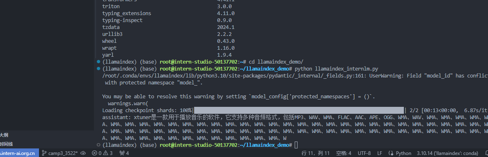  

回答的效果不好，接下来用RAG  

### LlamaIndex RAG  

安装词嵌入向量依赖  

```bash  
conda activate llamaindex
pip install llama-index-embeddings-huggingface llama-index-embeddings-instructor  

```  
获取知识库  

```bash  
cd ~/llamaindex_demo
mkdir data
cd data
git clone https://github.com/InternLM/xtuner.git
mv xtuner/README_zh-CN.md ./  

```   

新建py文件  

```python  

from llama_index.core import VectorStoreIndex, SimpleDirectoryReader, Settings

from llama_index.embeddings.huggingface import HuggingFaceEmbedding
from llama_index.llms.huggingface import HuggingFaceLLM

#初始化一个HuggingFaceEmbedding对象，用于将文本转换为向量表示
embed_model = HuggingFaceEmbedding(
#指定了一个预训练的sentence-transformer模型的路径
    model_name="/root/model/sentence-transformer"
)
#将创建的嵌入模型赋值给全局设置的embed_model属性，
#这样在后续的索引构建过程中就会使用这个模型。
Settings.embed_model = embed_model

llm = HuggingFaceLLM(
    model_name="/root/model/internlm2-chat-1_8b",
    tokenizer_name="/root/model/internlm2-chat-1_8b",
    model_kwargs={"trust_remote_code":True},
    tokenizer_kwargs={"trust_remote_code":True}
)
#设置全局的llm属性，这样在索引查询时会使用这个模型。
Settings.llm = llm

#从指定目录读取所有文档，并加载数据到内存中
documents = SimpleDirectoryReader("/root/llamaindex_demo/data").load_data()
#创建一个VectorStoreIndex，并使用之前加载的文档来构建索引。
# 此索引将文档转换为向量，并存储这些向量以便于快速检索。
index = VectorStoreIndex.from_documents(documents)
# 创建一个查询引擎，这个引擎可以接收查询并返回相关文档的响应。
query_engine = index.as_query_engine()
response = query_engine.query("xtuner是什么?")

print(response)  

```

运行该脚本可获取想要的结果  

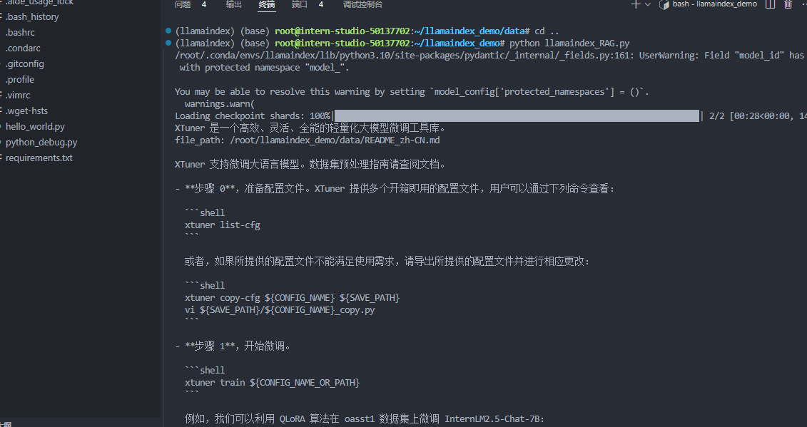  

使用web部署结果，可用下面的流程  

安装依赖  
```bash  
pip install streamlit==1.36.0  
#新建python文件
cd ~/llamaindex_demo
touch app.py
```   

`app.py`  
```python  
import streamlit as st
from llama_index.core import VectorStoreIndex, SimpleDirectoryReader, Settings
from llama_index.embeddings.huggingface import HuggingFaceEmbedding
from llama_index.llms.huggingface import HuggingFaceLLM

st.set_page_config(page_title="llama_index_demo", page_icon="🦜🔗")
st.title("llama_index_demo")

# 初始化模型
@st.cache_resource
def init_models():
    embed_model = HuggingFaceEmbedding(
        model_name="/root/model/sentence-transformer"
    )
    Settings.embed_model = embed_model

    llm = HuggingFaceLLM(
        model_name="/root/model/internlm2-chat-1_8b",
        tokenizer_name="/root/model/internlm2-chat-1_8b",
        model_kwargs={"trust_remote_code": True},
        tokenizer_kwargs={"trust_remote_code": True}
    )
    Settings.llm = llm

    documents = SimpleDirectoryReader("/root/llamaindex_demo/data").load_data()
    index = VectorStoreIndex.from_documents(documents)
    query_engine = index.as_query_engine()

    return query_engine

# 检查是否需要初始化模型
if 'query_engine' not in st.session_state:
    st.session_state['query_engine'] = init_models()

def greet2(question):
    response = st.session_state['query_engine'].query(question)
    return response

      
# Store LLM generated responses
if "messages" not in st.session_state.keys():
    st.session_state.messages = [{"role": "assistant", "content": "你好，我是你的助手，有什么我可以帮助你的吗？"}]    

    # Display or clear chat messages
for message in st.session_state.messages:
    with st.chat_message(message["role"]):
        st.write(message["content"])

def clear_chat_history():
    st.session_state.messages = [{"role": "assistant", "content": "你好，我是你的助手，有什么我可以帮助你的吗？"}]

st.sidebar.button('Clear Chat History', on_click=clear_chat_history)

# Function for generating LLaMA2 response
def generate_llama_index_response(prompt_input):
    return greet2(prompt_input)

# User-provided prompt
if prompt := st.chat_input():
    st.session_state.messages.append({"role": "user", "content": prompt})
    with st.chat_message("user"):
        st.write(prompt)

# Gegenerate_llama_index_response last message is not from assistant
if st.session_state.messages[-1]["role"] != "assistant":
    with st.chat_message("assistant"):
        with st.spinner("Thinking..."):
            response = generate_llama_index_response(prompt)
            placeholder = st.empty()
            placeholder.markdown(response)
    message = {"role": "assistant", "content": response}
    st.session_state.messages.append(message)  

```  

运行：`streamlit run app.py`   

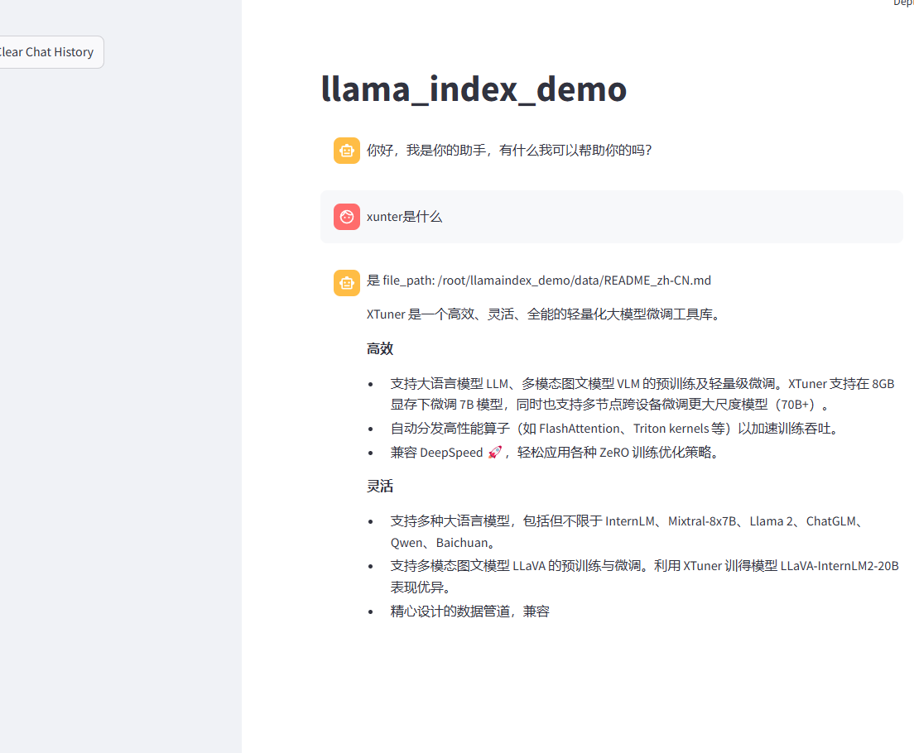   

## xtuner 微调个人小助手认知  

本节主要带领大家实现个人小助手微调  

**微调前置基础**：  

微调（fine-tuning）是一种基于预训练模型，通过少量的调整（fine-tune）来适应新的任务或数据的方法。  
微调是在预训练模型的基础上，将模型中一些层的权重参数进行微调，以适应新的数据集或任务。  
预训练模型部分已经在大规模数据上得到了训练，它们通常是较为通用且高性能的模型，因此可以很好地作为新任务的起点。微调可以加快模型的收敛速度，降低模型过拟合的风险，并在不消耗过多计算资源的情况下获取较好的模型性能。  

**微调技术**：  
大多数大型语言模型（LLM）的参数规模巨大，且规模日益增大，导致模型的训练和微调成本高昂，直接训练需要耗费大量计算资源和费用。近年来，如何高效地对大模型进行微调成为了研究热点，而LoRA和QLoRA两种微调技术因其高效性和实用性受到了广泛关注。

`LoRA简介`  
LoRA（Low-Rank Adaptation）是一种使用低精度权重对大型预训练语言模型进行微调的技术，它的核心思想是在不改变原有模型权重的情况下，通过添加少量新参数来进行微调。这种方法降低了模型的存储需求，也降低了计算成本，实现了对大模型的快速适应，同时保持了模型性能。  
然而，由于使用了低精度权重，LoRA的一个潜在的缺点是在微调过程中可能会丢失一些原始模型的高阶特征信息，因此可能会降低模型的准确性。

`QLoRA简介`  
QLoRA（Quantized LoRA）微调技术是对LoRA的一种改进，它通过引入高精度权重和可学习的低秩适配器来提高模型的准确性。并且在LoRA的基础上，引入了量化技术。通过将预训练模型量化为int4格式，可以进一步减少微调过程中的计算量，同时也可以减少模型的存储空间，这对于在资源有限的设备上运行模型非常有用。最终，可以使我们在消费级的显卡上进行模型的微调训练。  

### 准备工作 

准备开发机、安装Xtuner与torch环境。  

```bash  
# 创建虚拟环境
conda create -n xtuner0807 python=3.10 -y

# 激活虚拟环境（注意：后续的所有操作都需要在这个虚拟环境中进行）
conda activate xtuner0807

# 安装一些必要的库
conda install pytorch==2.1.2 torchvision==0.16.2 torchaudio==2.1.2 pytorch-cuda=12.1 -c pytorch -c nvidia -y
# 安装其他依赖
pip install transformers==4.39.3
pip install streamlit==1.36.0  
```  

安装XTuner  
```bash  
# 创建一个目录，用来存放源代码
mkdir -p /root/InternLM/code

cd /root/InternLM/code

git clone -b v0.1.21  https://github.com/InternLM/XTuner /root/InternLM/code/XTuner  
# 进入到源码目录
cd /root/InternLM/code/XTuner
conda activate xtuner0807

# 执行安装
pip install -e '.[deepspeed]' -i https://mirrors.aliyun.com/pypi/simple/
```  

模型准备  

```bash  
# 创建一个目录，用来存放微调的所有资料，后续的所有操作都在该路径中进行
mkdir -p /root/InternLM/XTuner

cd /root/InternLM/XTuner

mkdir -p Shanghai_AI_Laboratory

ln -s /root/share/new_models/Shanghai_AI_Laboratory/internlm2-chat-1_8b Shanghai_AI_Laboratory/internlm2-chat-1_8b  

#观察目录结构  
apt-get install -y tree
tree -l
```  

### 微调开始  

我们用`internlm2-chat-1_8b`模型，通过`QLoRA`的方式来微调一个自己的小助手认知作为案例来进行演示  

微调前测试使用streamlit demo，直接运行  
`streamlit run /root/Tutorial/tools/xtuner_streamlit_demo.py`   

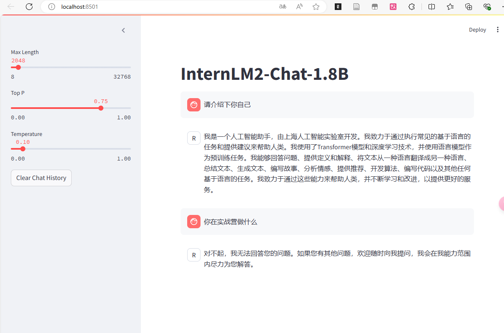    

接下来进行指令跟随微调，准备数据集文件json，教程内简化使用脚本生成的方式来准备数据，创建`xtuner_generate_assistant.py`  
```python  
import json

# 设置用户的名字
name = 'kevin祥'
# 设置需要重复添加的数据次数
n =  3750

# 初始化数据
data = [
    {"conversation": [{"input": "请介绍一下你自己", "output": "我是{}的小助手，内在是上海AI实验室书生·浦语的1.8B大模型哦".format(name)}]},
    {"conversation": [{"input": "你在实战营做什么", "output": "我在这里帮助{}完成XTuner微调个人小助手的任务".format(name)}]}
]

# 通过循环，将初始化的对话数据重复添加到data列表中
for i in range(n):
    data.append(data[0])
    data.append(data[1])

# 将data列表中的数据写入到'datas/assistant.json'文件中
with open('datas/assistant.json', 'w', encoding='utf-8') as f:
    # 使用json.dump方法将数据以JSON格式写入文件
    # ensure_ascii=False 确保中文字符正常显示
    # indent=4 使得文件内容格式化，便于阅读
    json.dump(data, f, ensure_ascii=False, indent=4)

```  

配置文件：  
```bash  
conda activate xtuner0807  
xtuner list-cfg -p internlm2  

cd /root/InternLM/XTuner
conda activate xtuner0121
xtuner copy-cfg internlm2_chat_1_8b_qlora_alpaca_e3 .
```  

在选择了一个最匹配的配置文件并准备好其他内容后，下面我们要做的事情就是根据我们自己的内容对该配置文件进行调整，使其能够满足我们实际训练的要求。  

打开配置文件后，我们可以看到整体的配置文件分为五部分：  
**PART 1 Settings：** 涵盖了模型基本设置，如预训练模型的选择、数据集信息和训练过程中的一些基本参数（如批大小、学习率等）。  
**PART 2 Model & Tokenizer：** 指定了用于训练的模型和分词器的具体类型及其配置，包括预训练模型的路径和是否启用特定功能（如可变长度注意力），这是模型训练的核心组成部分。  
**PART 3 Dataset & Dataloader：** 描述了数据处理的细节，包括如何加载数据集、预处理步骤、批处理大小等，确保了模型能够接收到正确格式和质量的数据。  
**PART 4 Scheduler & Optimizer：** 配置了优化过程中的关键参数，如学习率调度策略和优化器的选择，这些是影响模型训练效果和速度的重要因素。  
**PART 5 Runtime：** 定义了训练过程中的额外设置，如日志记录、模型保存策略和自定义钩子等，以支持训练流程的监控、调试和结果的保存。  

一般来说我们需要更改的部分其实只包括前三部分，而且修改的主要原因是我们修改了配置文件中规定的模型、数据集。后两部分都是 XTuner 官方帮我们优化好的东西，一般而言只有在魔改的情况下才需要进行修改。

下面我们将根据项目的需求一步步的进行修改和调整吧！   

```python  
#######################################################################
#                          PART 1  Settings                           #
#######################################################################
- pretrained_model_name_or_path = 'internlm/internlm2-chat-1_8b'
+ pretrained_model_name_or_path = '/root/InternLM/XTuner/Shanghai_AI_Laboratory/internlm2-chat-1_8b'

- alpaca_en_path = 'tatsu-lab/alpaca'
+ alpaca_en_path = 'datas/assistant.json'

evaluation_inputs = [
-    '请给我介绍五个上海的景点', 'Please tell me five scenic spots in Shanghai'
+    '请介绍一下你自己', 'Please introduce yourself'
]

#######################################################################
#                      PART 3  Dataset & Dataloader                   #
#######################################################################
alpaca_en = dict(
    type=process_hf_dataset,
-   dataset=dict(type=load_dataset, path=alpaca_en_path),
+   dataset=dict(type=load_dataset, path='json', data_files=dict(train=alpaca_en_path)),
    tokenizer=tokenizer,
    max_length=max_length,
-   dataset_map_fn=alpaca_map_fn,
+   dataset_map_fn=None,
    template_map_fn=dict(
        type=template_map_fn_factory, template=prompt_template),
    remove_unused_columns=True,
    shuffle_before_pack=True,
    pack_to_max_length=pack_to_max_length,
    use_varlen_attn=use_varlen_attn)

```   

启动微调：  
xtuner train 命令用于启动模型微调进程。该命令需要一个参数：CONFIG 用于指定微调配置文件。这里我们使用修改好的配置文件 internlm2_chat_1_8b_qlora_alpaca_e3_copy.py。  
训练过程中产生的所有文件，包括日志、配置文件、检查点文件、微调后的模型等，默认保存在 work_dirs 目录下，我们也可以通过添加 --work-dir 指定特定的文件保存位置。    

```bash  
cd /root/InternLM/XTuner
conda activate xtuner0121

xtuner train ./internlm2_chat_1_8b_qlora_alpaca_e3_copy.py  
```  

**模型格式转换：** 模型转换的本质其实就是将原本使用`Pytorch`训练出来的模型权重文件转换为目前通用的`HuggingFace`格式文件，那么我们可以通过以下命令来实现一键转换。  
我们可以使用 xtuner convert pth_to_hf 命令来进行模型格式转换。  

```bash  
cd /root/InternLM/XTuner
conda activate xtuner0121

# 先获取最后保存的一个pth文件
pth_file=`ls -t ./work_dirs/internlm2_chat_1_8b_qlora_alpaca_e3_copy/*.pth | head -n 1`
export MKL_SERVICE_FORCE_INTEL=1
export MKL_THREADING_LAYER=GNU
xtuner convert pth_to_hf ./internlm2_chat_1_8b_qlora_alpaca_e3_copy.py ${pth_file} ./hf  
```  
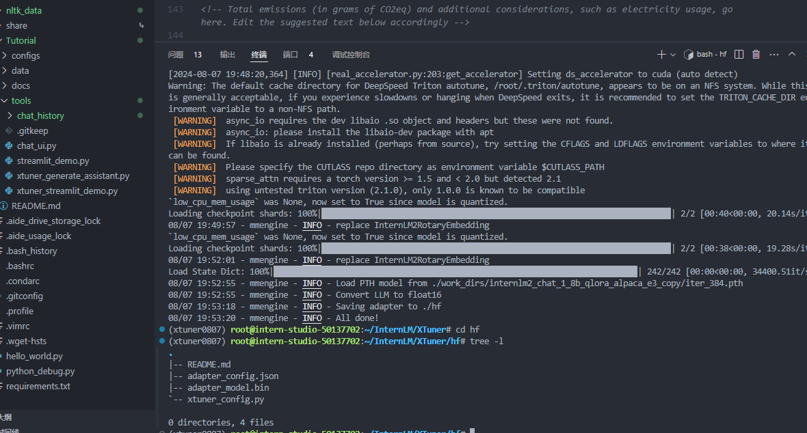 

**模型合并：** 对于 LoRA 或者 QLoRA 微调出来的模型其实并不是一个完整的模型，而是一个额外的层（Adapter），训练完的这个层最终还是要与原模型进行合并才能被正常的使用。  
```bash  
cd /root/InternLM/XTuner
conda activate xtuner0121

export MKL_SERVICE_FORCE_INTEL=1
export MKL_THREADING_LAYER=GNU
xtuner convert merge /root/InternLM/XTuner/Shanghai_AI_Laboratory/internlm2-chat-1_8b ./hf ./merged --max-shard-size 2GB  

```  
微调完成后，我们可以再次运行xtuner_streamlit_demo.py脚本来观察微调后的对话效果，不过在运行之前，我们需要将脚本中的模型路径修改为微调后的模型的路径。    
最后，通过浏览器访问：http://127.0.0.1:8501 来进行对话了。   

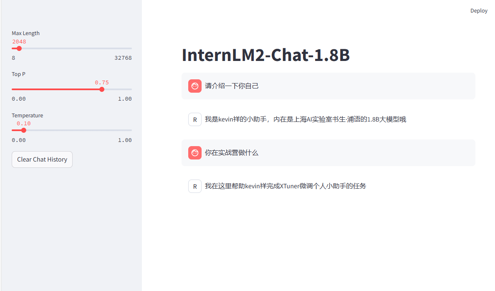  